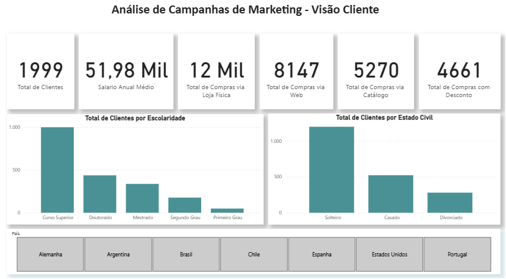
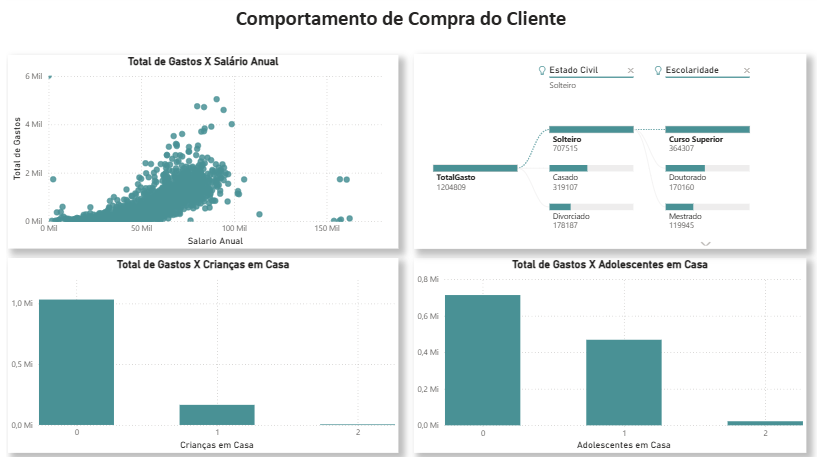
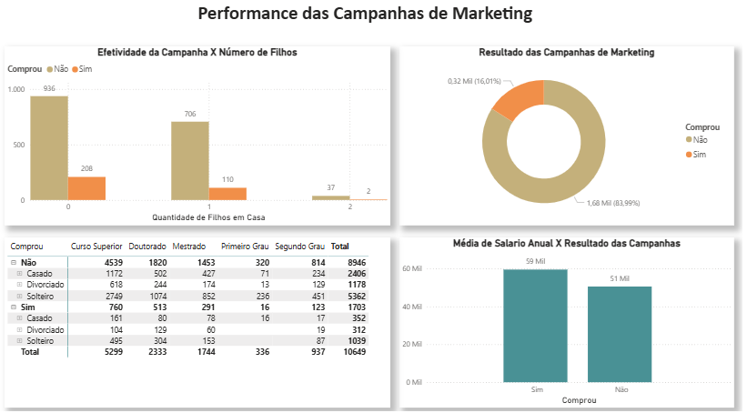
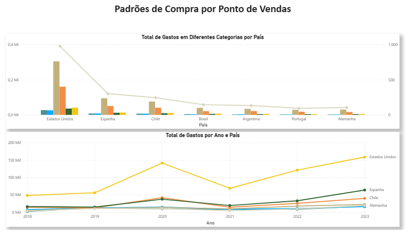

# Análise de Campanhas de Marketing - Power BI

## Resumo do Projeto

Este projeto apresenta uma análise abrangente de dados de marketing utilizando Power BI, com foco na performance de campanhas publicitárias e comportamento do consumidor. O dashboard analisa informações de 2.000 clientes across 7 países, incluindo dados demográficos, padrões de compra, efetividade de campanhas e preferências de canais de venda.

O projeto está estruturado em 4 páginas principais: **Performance das Campanhas**, **Análise de Cliente**, **Comportamento de Compra** e **Padrões por Ponto de Venda**, oferecendo insights estratégicos para otimização de campanhas e segmentação de clientes.

---

## Insights e Análises

### 📊 **Análise de Cliente**

**Principais Insights:**
- **Base de Clientes:** 1.999 clientes ativos com salário anual médio de R$ 51,98 mil
- **Canais de Compra:** Predominância de compras em loja física (12 mil), seguido por web (8.147) e catálogo (5.270)
- **Perfil Educacional:** Maior concentração de clientes com Curso Superior (~1.000), seguido por Doutorado e Mestrado
- **Estado Civil:** Clientes solteiros representam a maior parcela (~1.000), seguidos por casados (~500) e divorciados (~200)
- **Descontos:** 4.661 compras realizadas com desconto, indicando sensibilidade a preço
- **Presença Global:** Atuação em 7 países (Alemanha, Argentina, Brasil, Chile, Espanha, Estados Unidos e Portugal)

---

### 🛒 **Comportamento de Compra**

**Principais Insights:**
- **Correlação Renda x Gastos:** Forte correlação positiva entre salário anual e gastos totais, com concentração na faixa de 0-100k de salário
- **Segmentação por Escolaridade:** Clientes com Curso Superior apresentam maiores gastos totais, seguidos por Doutorado
- **Impacto Familiar:** 
  - Clientes sem crianças em casa gastam significativamente mais (~1.0M total)
  - Presença de adolescentes reduz gastos (~0.4M vs ~0.7M sem adolescentes)
- **Estado Civil:** Solteiros demonstram maior poder de compra, seguidos por casados e divorciados

---

### 📈 **Performance das Campanhas**

**Principais Insights:**
- **Efetividade Geral:** Taxa de conversão de campanhas em 16,01% (320 mil de 2 milhões)
- **Segmentação por Filhos:** 
  - Clientes sem filhos: maior volume de campanhas (936) e conversões (206)
  - Famílias com 2+ filhos: menor engajamento
- **Educação x Conversão:** 
  - Doutorado: maior taxa de conversão proporcional
  - Curso Superior: maior volume absoluto de participação
- **Renda x Campanhas:** Clientes que compraram apresentam salário médio superior (~50 mil) comparado aos não-compradores (~<40 mil)

---

### 🏪 **Padrões por Ponto de Venda**

**Principais Insights:**
- **Liderança dos EUA:** Estados Unidos dominam em gastos por categoria, especialmente em eletrônicos e móveis
- **Diversificação Espanhola:** Espanha apresenta distribuição equilibrada entre categorias
- **Tendência Temporal (2018-2023):**
  - Estados Unidos: crescimento consistente, atingindo ~150 mil em 2023
  - Espanha: crescimento estável (~50 mil)
  - Chile e Argentina: performance moderada e estável
  - Alemanha e Portugal: mercados menores mas consistentes
- **Categorias Principais:** Móveis e eletrônicos lideram os gastos globalmente

---

## Arquivos do Projeto

- `analise_marketing.pbix` - Arquivo principal do Power BI
- `dados_marketing.csv` - Dataset com 2.000 registros de clientes
- `images/` - Capturas das 4 páginas do dashboard

## Tecnologias Utilizadas

- **Power BI Desktop** - Desenvolvimento do dashboard
- **DAX** - Linguagem para medidas e cálculos
- **Power Query** - Tratamento e transformação dos dados

## Como Utilizar

1. Faça o download do arquivo `.pbix`
2. Abra no Power BI Desktop
3. Atualize a fonte de dados apontando para o arquivo `dados_marketing.csv`
4. Explore os insights interagindo com os filtros e visualizações
